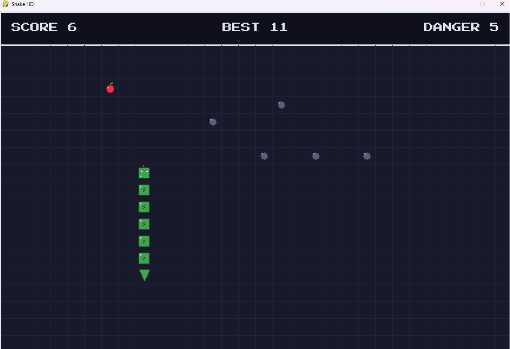

# Snake HD 🐍

A modernized Snake game built with Python and Pygame.

This project started as a simple Nokia-style Snake clone and evolved into a modular, sprite-based retro arcade game with persistent high scores, custom graphics, and scalable game architecture.


## Features

* Pixel-art sprite system
* Persistent high score saving
* Pause system
* Start menu
* Game Over screen
* Enemy mines that spawn over time
* Increasing difficulty as score grows
* Screen wrap movement
* Modular code structure
* Retro pixel font
* HD resolution support

## Controls

| Key     | Action                  |
| ------- | ----------------------- |
| ↑ ↓ ← → | Move Snake              |
| P       | Pause / Resume          |
| ENTER   | Start Game              |
| SPACE   | Restart After Game Over |

## Installation

Clone the repository:

```bash
git clone https://github.com/yourusername/snake-hd.git
cd snake-hd
```

Install dependencies:

```bash
pip install -r requirements.txt
```

Run the game:

```bash
python snake.py
```

## Project Structure

```text
snake-hd/
│
├── snake.py
│
├── assets/
│   ├── PressStart2P.ttf
│   └── sprites/
│       ├── head.png
│       ├── body.png
│       ├── tail.png
│       ├── food.png
│       └── mine.png
│
├── game/
│   ├── settings.py
│   ├── snake_logic.py
│   ├── collision_logic.py
│   └── spawn_logic.py
│
├── helpers/
│   ├── helper_function.py
│   └── storage.py
│
├── highscore.txt
├── requirements.txt
└── README.md
```

## Gameplay

Eat food to grow and increase your score.

As the game progresses:

* The snake moves faster.
* New enemy mines spawn on the map.
* Avoid colliding with your own body.
* Avoid enemy mines.
* Try to beat your highest score.

## Future Improvements

* Sound effects and music
* Animated sprites
* Particle effects
* Multiple enemy types
* Power-ups
* Leaderboard system
* Mobile version

## Built With

* Python
* Pygame

## License

This project is released under the MIT License.
